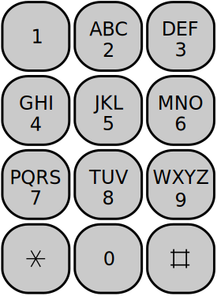

<h1>Predictive contact list </h1>

Introduction
Suppose a user wishes to find the name "cox" in a contact list. In a traditional "multi-tap" keypad entry system, it would be necessary to do the following:
- Press 2 (abc) three times to select c.
- Press 6 (mno) three times to select o.
- Press 9 (wxyz) twice to select x.

Meanwhile, in a predictive contact list, it is only necessary to:
- Press 2 once to select the (abc) group for the first character.
- Press 6 once to select the (mno) group for the second character.
- Press 9 once to select the (wxyz) group for the third character.
In this case, predictive mechanism reduced the number of button presses from 8 to 3.

This is a telephone keypad:

Task
Your task is to write a method that takes two arguments:
- contacts - a list of contacts stored in the phone (unordered list of strings containing the names with the lowercase english letters). This may be an empty list (but not null).
- keystrokes - a string which represents a sequence of keystrokes (only digits in the range [2,9]). This may be an empty sequence (but not null).
The method should return a list of possible contacts for the sequence of keystrokes using prediction mechanism.

Example
For input:
- contacts: ["jones", "thompson", "brown", "taylor", "bow", "smith", "cox", "timmons"]
- keystrokes: "2"
Output contact list should contain three names: ["brown", "bow", "cox"].